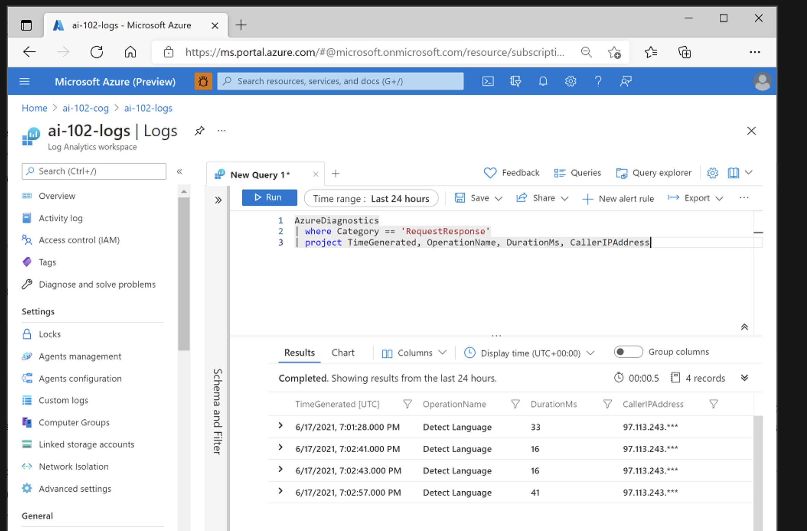

# Monitor Azure AI services

### Learning objectives

After completing this module, you will be able to:
- Monitor Azure AI services costs.
- Create alerts and view metrics for Azure AI services.
- Manage Azure AI services diagnostic logging.

## Unit 01: Introduction

You should monitor AI services to track costs, identify utilization trends, and detect potential issues.

## Unit 02: Monitor Costs

Some Azure AI services resources offer a free tier with restrictions on use, which is useful for development and testing; and one or more billed tiers that incur charges based on transactions.

### Plan costs for AI services

Before deploying a solution that depends on AI services, you can estimate costs by using the [Azure Pricing Calculator](https://azure.microsoft.com/en-us/pricing/calculator/).

To use the pricing calculator to estimate AI services costs, create a new estimate and select Azure AI services in the AI + Machine Learning category. Then select the specific AI service API you plan to use.

After you've created an estimate, you can save it. You can also export it in Microsoft Excel format.

### View costs for AI services

To view costs for AI services, sign into the Azure portal and select your subscription. You can then view overall costs for the subscription by selecting the Cost analysis tab. 

To view only costs for AI services, add a filter that restricts the data to reflect resources with a service name of Cognitive Services.

## Unit 03: Create Alerts

Microsoft Azure provides alerting support for resources through the creation of alert rules. You use alert rules to configure notifications and alerts for your resources based on events or metric thresholds.

To create an alert rule for an Azure AI services resource, select the resource in the Azure portal and on the Alerts tab, add a new alert rule. To define the alert rule, you must specify:

### Alert Rules:

To create an alert rule for an Azure AI services resource, select the resource in the Azure portal and on the Alerts tab, add a new alert rule. To define the alert rule, you must specify:

- The scope of the alert rule - in other words, the resource you want to monitor.
- A condition on which the alert is triggered. The specific trigger for the alert is based on a signal type, which can be Activity Log (an entry in the activity log created by an action performed on the resource, such as regenerating its subscription keys) or Metric (a metric threshold such as the number of errors exceeding 10 in an hour).
- Optional actions, such as sending an email to an administrator notifying them of the alert, or running an Azure Logic App to address the issue automatically.
- Alert rule details, such as a name for the alert rule and the resource group in which it should be defined.

## Unit 04: View Metrics

In the case of Azure AI services, Azure Monitor collects metrics relating to endpoint requests, data submitted and returned, errors, and other useful measurements.

### View metrics in the Azure portal

You can view metrics for an individual resource in the Azure portal by selecting the resource and viewing its Metrics page. On this page, you can add resource-specific metrics to charts. 

You can add multiple metrics to a chart and choose appropriate aggregations and chart types. When you're satisfied with chart, you can share it by exporting it to Excel or copying a link to it, and you can clone it to create a duplicate chart .

### Add metrics to a dashboard

you can create dashboards that consist of multiple visualizations from different resources in your Azure environment to help you gain an overall view of the health and performance of your Azure resources.

To create a dashboard, select Dashboard in the Azure portal menu.

### Unit 05: Manage Diagnostic Logging

Diagnostic logging enables you to capture rich operational data for an Azure AI services resource, which can be used to analyze service usage and troubleshoot problems.

### Create resources for diagnostic log storage

To capture diagnostic logs for an AI services resource, you need a destination for the log data. You can use Azure Event Hubs as a destination in order to then forward the data on to a custom telemetry solution, and you can connect directly to some third-party solutions; but in most cases you'll use one (or both) of the following kinds of resource within your Azure subscription:

- Azure Log Analytics - a service that enables you to query and visualize log data within the Azure portal.
- Azure Storage - a cloud-based data store that you can use to store log archives (which can be exported for analysis in other tools as needed).

You should create these resources before configuring diagnostic logging for your AI services resource. 

### Configure diagnostic settings

With your log destinations in place, you can configure diagnostic settings for your AI services resource. You define diagnostic settings on the Diagnostic settings page of the blade for your AI services resource in the Azure portal. When you add diagnostic settings, you must specify:

- A name for your diagnostic settings.
- The categories of log event data that you want to capture.
- Details of the destinations in which you want to store the log data.

### View log data in Azure Log Analytics

It can take an hour or more before diagnostic data starts flowing to the destinations, but when the data has been captured, you can view it in your Azure log Analytics resource by running queries

## Unit 06: Exercise - Monitor Azure AI Services

https://microsoftlearning.github.io/mslearn-ai-services/Instructions/Exercises/03-monitor-ai-services.html#configure-an-alert

