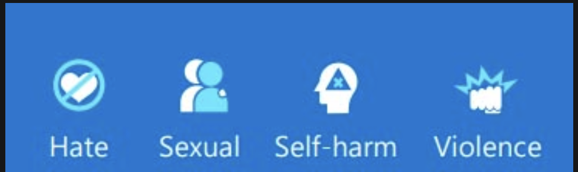

# Use AI responsibly with Azure AI Content Safety

Azure AI Content Safety is a comprehensive tool designed to detect and manage harmful content in both user-generated and AI-generated materials. 

 Learning objectives

By the end of this module, you'll be able to:

- Describe Azure AI Content Safety.
- Describe how Azure AI Content Safety operates.
- Describe when to use Azure AI Content Safety. 

## Introduction

Azure AI Content Safety is an AI service designed to help developers include advanced content safety into their applications and services.

The need for improving online content safety has four main drivers:
- Increase in harmful content
- Regulatory pressures
- Transparency
- Complex (multi-modal) content

## What is Content Safety?

Azure AI Content Safety is a set of advanced content moderating features that can be incorporated into your applications and services. Azure AI Content Safety is available as a resource in the Azure portal as part of [Azure AI Studio](https://ai.azure.com/explore/contentsafety).

For guided practice using Azure AI Content Studio, see [Moderate content and detect harm with Azure AI Content Safety Studio](https://learn.microsoft.com/en-us/training/modules/moderate-content-detect-harm-azure-ai-content-safety-studio/).

## How does Azure AI Content Safety work?

Azure AI Content Safety works with text and images, and AI-generated content. It is multilingual and can detect harmful content in both short form and long form and is currently available in English, German, Spanish, French, Portuguese, Italian, and Chinese.

Azure AI Content Safety classifies content into four categories, which is used to determine whether content should be blocked, sent to a moderator, or auto approved.:

## Options for Safeguarding text content

1. **Moderate text** scans text across four categories: violence, hate speech, sexual content, and self-harm. A severity level from 0 to 6 is returned for each category. You can also create a blocklist to scan for terms specific to your situation.

2. **Prompt shields** is a unified API to identify and block jailbreak attacks from inputs to LLMs. It includes both user input and documents.

3. **Protected material detection** checks AI-generated text for protected text such as recipes, copyrighted song lyrics, or other original material.

4. **Groundedness detection** protects against inaccurate responses in AI-generated text by LLMs.
    - A grounded response is one where the model’s output is based on the source information. 
    - An ungrounded response is one where the model's output varies from the source information. 
    - Groundedness detection includes a reasoning option in the API response. This adds a reasoning field that explains any ungroundedness detection.

## Options for Safeguarding image content

1. **Moderate images** scans for inappropriate content across four categories: violence, self-harm, sexual, and hate. A severity level is returned: safe, low, or high. You then set a threshold level of low, medium, or high. The combination of the severity and threshold level determines whether the image is allowed or blocked for each category.

2. **Moderate multimodal content** scans both images and text, including text extracted from an image using optical character recognition (OCR). Content is analyzed across four categories: violence, hate speech, sexual content, and self-harm.

## Custom safety solutions

1. **Custom categories** enables you to create your own categories by providing positive and negative examples, and training the model.
2. **Safety system message** helps you to write effective prompts to guide an AI system's behavior.

## Evaluating accuracy

When evaluating how accurately Azure AI Content Safety is for your situation, compare its performance against four criteria:

- True positive - correct identification of harmful content.
- False positive - incorrect identification of harmful content.
- True negative - correct identification of harmless content.
- False negative - harmful content isn't identified.

Azure AI Content Safety works best to support human moderators who can resolve cases of incorrect identification

## When to use Azure AI Content Safety

Content on:
- Education platforms
- Social 
- Gaming
- Brands
- News
- Ecommerce
- GenAI services

can be susceptible to harmful content. Azure AI Content Safety can help you to manage this content effectively.

## Exercise - Implementing Azure AI Content Safety

https://microsoftlearning.github.io/mslearn-ai-services/Instructions/Exercises/05-implement-content-safety.html

